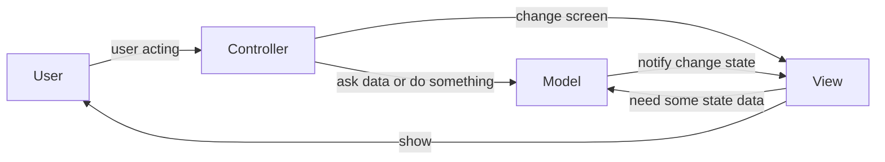

# MVC
## preview

###  model
- main logic
- used by view
- 동작, 상태, 데이터, 논리 등의 집합체
- 가장 무거운 객체

### view
- 모델을 사용하고 표시
- 직접적인 모델의 동작은 모름. 모델이 주는 대로 사용
- 모델과 느슨하게 의존하고 있어야 함

### controller
- view에 model을 연결
- 중계
- mutation
- sync
- 최대한 가볍게

## flow

## patt
### controller
- 전략패턴
  - 뷰 / 모델 분리
  - 뷰의 전략을 선택

### model
- 옵저버
  - 상태의 추적, 변경
  - 뷰와 컨트롤러 분리

### view
- 컴포지트
  - 컨트롤러는 최상위 컴포넌트에만 요청하고 갱신은 컴포지트에서 뷰 구성요소들에게 각자 처리
