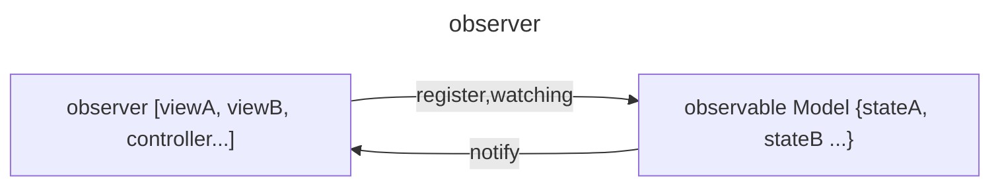
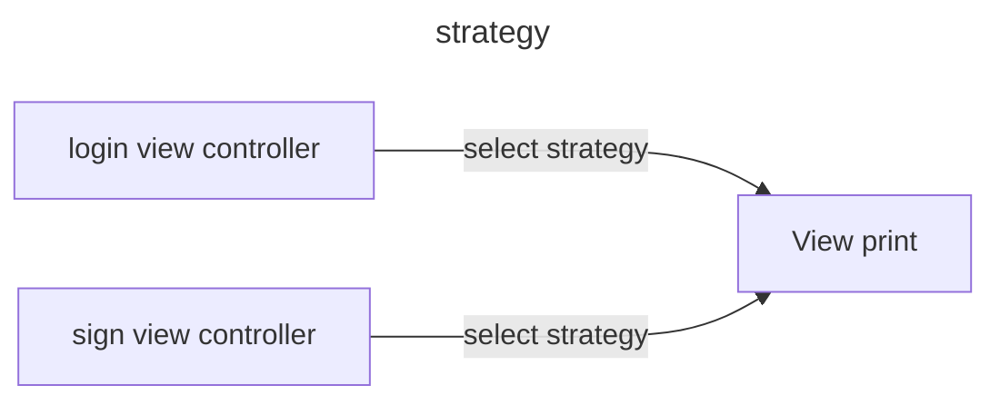
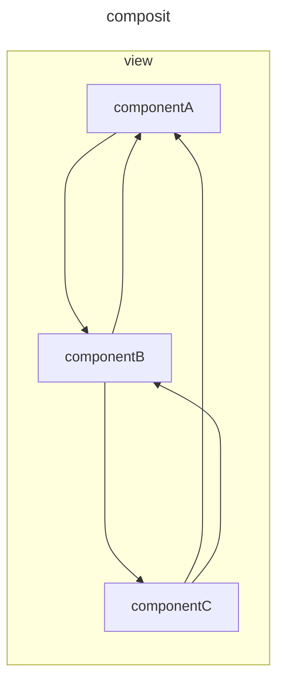

# MVC patt
## pic

```mermaid
---
title: observer
---
flowchart LR;
    View["observer [viewA, viewB, controller...]"]--->|register,watching|Model["observable Model {stateA, stateB ...}"]
    Model--->|notify| View
```

```mermaid
---
title: strategy
---
flowchart LR;
    ControllerA["login view controller"]--->|select strategy|View["View print"]
    ControllerB["sign view controller"]--->|select strategy|View
```

```mermaid
---
title: composit
---
flowchart LR;
    subgraph view 
        componentA---->componentB
        componentB---->componentC
        componentC---->componentA
        componentB---->componentA
        componentC---->componentB
    end
```
